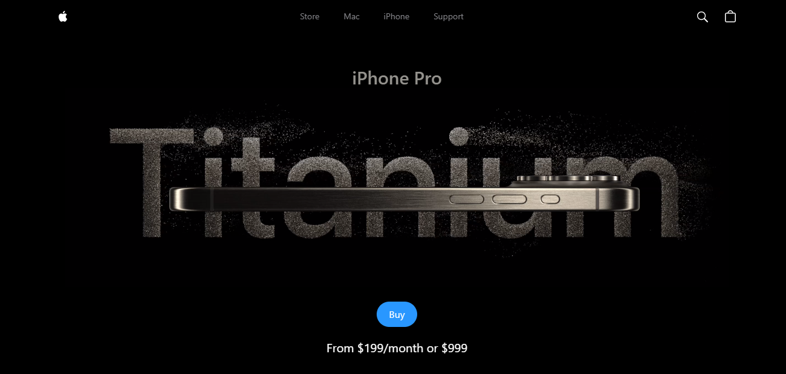

# Apple Clone Project

Welcome to the Apple Clone Project! This repository showcases a clone of the Apple website, demonstrating various features and components using React, GSAP, and Three.js for animations and 3D rendering.

## Demo

Check out the live demo of the Apple Clone Project hosted [here](https://appleclone.webstreams.site).

---

## Table of Contents

1. [Features](#features)
2. [Hero](#hero)
3. [Highlights](#highlights)
4. [How It Works](#how-it-works)
5. [3D Model](#3d-model)
6. [Lights](#lights)
7. [Loader](#loader)
8. [Video Carousel](#video-carousel)
9. [Technologies Used](#technologies-used)
10. [Setup Instructions](#setup-instructions)
11. [Demo](#demo)
12. [Contributing](#contributing)
13. [License](#license)

---

## Features

The Features component showcases the design and functionality of the iPhone using videos and images, highlighting its aesthetics and technological advancements.

## Features Component Explanation

The **Features** component in this project showcases the design and features of the iPhone 15 Pro, particularly focusing on its titanium construction. Here’s a breakdown of what was implemented and why, from a front-end development perspective:

### GSAP Animation Integration

- **useGSAP Hook**: Utilized `useGSAP` hook from `@gsap/react` to initialize GSAP animations upon component mount. This ensures smooth and interactive animations throughout the component.
- **ScrollTrigger Animation**: Implemented GSAP's ScrollTrigger to animate elements such as the video (`#exploreVideo`) when it enters the viewport, enhancing user engagement.
- **Custom Animations**: Employed `animateWithGsap` function from `../utils/animations` to animate components like the title (`#features_title`), images (`.g_grow`), and text (`.g_text`) with properties like opacity, scale, and position for visual appeal.

### HTML Structure and Styling

- **Semantic HTML**: Used semantic HTML elements (`<section>`, `<h1>`, `<h2>`, `<video>`, ``, `
`) for accessibility and SEO optimization.
- **Responsive Design**: Integrated Tailwind CSS classes (`screen-max-width`, `mb-12`, `mt-32`, `sm:px-10`, `h-[50vh]`, `flex-center`) to ensure responsive layouts across different screen sizes and maintain consistent spacing and alignment.

### Multimedia Integration

- **Video Element**: Incorporated a `<video>` element (`exploreVideo`) to showcase the iPhone’s promotional video with attributes set for auto-play, muted, and preload for optimal user experience.
- **Image Elements**: Used images (`explore1Img`, `explore2Img`) to complement video content and visually reinforce the product’s titanium design features.

### Textual Content

- **Feature Descriptions**: Strategically placed textual content to describe the iPhone’s titanium construction features. Highlighted key information with specific styling (`feature-text`, `text-white`) to emphasize product attributes effectively.

## Why These Choices Were Made

- **GSAP for Animation**: Chose GSAP for its performance, flexibility, and extensive feature set, enabling precise control over animations and ensuring smooth transitions to enhance user interaction and visual appeal.

- **Semantic HTML and Accessibility**: Ensured accessibility and improved SEO by using semantic HTML elements that provide meaningful structure to content, benefiting users with disabilities and search engine crawlers.

- **Responsive Design with Tailwind CSS**: Implemented Tailwind CSS utility classes for rapid prototyping and responsive design, maintaining design consistency across various devices without extensive custom CSS.

- **Multimedia Integration**: Combined videos and images to create a multimedia experience that effectively showcases the iPhone’s features, catering to diverse user preferences and enhancing engagement.
- **Textual Clarity and Highlighting**: Provided clear and concise feature descriptions with highlighted text to effectively communicate key product attributes, improving user comprehension and emphasizing unique selling points.

### Conclusion

The implementation of the **Features** component aims to deliver an immersive and informative experience for users exploring the iPhone 15 Pro’s titanium design features. The use of GSAP for animations, Tailwind CSS for responsive design, and multimedia integration contributes to a compelling user interface aligned with modern web development standards and practices.

---

## Hero

The Hero component introduces users to Apple products with a captivating video and a call-to-action button to engage visitors.

## Hero Component Explanation

The **Hero** component in this project serves as the introductory section showcasing the iPhone Pro. Here’s a breakdown of what was implemented and why, from a front-end development perspective:

### Dynamic Video Source Selection

- **useState Hook**: Utilized `useState` hook to dynamically set the video source (`videoSrc`) based on the window width. This ensures that smaller screens load a smaller video (`smallHeroVideo`), optimizing performance and user experience.
- **useEffect Hook**: Used `useEffect` hook to add and remove a resize event listener (`handleVideoSrcSet`). When the window is resized, it checks the window width and updates the video source accordingly, ensuring responsiveness without excessive re-renders.
- **Video Element**: Integrated a `<video>` element with attributes for autoplay, muted, and playsInline to ensure seamless video playback and compatibility across different browsers and devices.

### GSAP Animation Integration

- **useGSAP Hook**: Implemented the `useGSAP` hook from `@gsap/react` to animate elements (`#hero`, `#cta`) upon component mount. GSAP animations are triggered with a delay (`1.5s`) to enhance visual appeal and user engagement.
- **GSAP Animations**: Used GSAP's `gsap.to` method to animate the opacity and position (`y`) of elements (`#hero`, `#cta`). This provides smooth transitions and visual effects, making the hero section more interactive and appealing.

### HTML Structure and Styling

- **Semantic HTML**: Used semantic HTML elements (`<section>`, `
`, `<video>`, `<a>`, `
`) for accessibility and SEO optimization, ensuring a clear structure and meaningful content.
- **CSS Classes**: Applied Tailwind CSS utility classes (`w-full`, `flex-center`, `flex-col`, `opacity-0`, `translate-y-20`, `md:w-10/12`, `w-9/12`) for consistent styling and responsive design. This ensures that the hero section maintains its layout and appearance across various screen sizes.

### Call-to-Action (CTA) Button

- **CTA Button**: Included a call-to-action button (`<a>` tag) with a link (`#highlights`) to encourage user interaction. Styled with a Tailwind CSS class (`btn`) for a visually appealing button design.
- **Price Information**: Added a price indication (`From $199/month or $999`) below the CTA button to inform users about pricing options, enhancing transparency and decision-making.

## Why These Choices Were Made

- **Dynamic Video Source**: Chose to dynamically select the video source based on screen width to optimize performance and ensure seamless playback on smaller devices, providing a better user experience.

- **GSAP for Animation**: Implemented GSAP animations to create smooth transitions and visual effects, enhancing the hero section's visual appeal and engagement.

- **Responsive Design**: Used Tailwind CSS for responsive design to maintain consistent layout and styling across different screen sizes, ensuring accessibility and usability.

- **CTA Button and Price Information**: Included a prominent CTA button and price information to guide user actions and provide essential details upfront, improving user engagement and conversion potential.

### Conclusion

The **Hero** component effectively introduces the iPhone Pro with dynamic video content, GSAP animations, and a compelling call-to-action, showcasing best practices in front-end development for creating engaging and responsive web experiences.

---

## Highlights

The Highlights component presents key features and events related to the iPhone through interactive links and a video carousel, offering a comprehensive overview.

## Highlights Component Explanation

The **Highlights** component is designed to showcase key events and videos related to the iPhone Pro. Here’s an overview of the implementation and rationale from a front-end development perspective:

### GSAP Animation Integration

- **useGSAP Hook**: Utilized the `useGSAP` hook from `@gsap/react` to animate elements upon component mount. GSAP animations (`gsap.to`) were applied to elements (`#title`, `.link`) to set their opacity and position (`y`), enhancing visual appeal and user engagement.
- **Title Animation**: Animated the title (`#title`) to fade in and move into position (`y: 0`), ensuring a smooth transition and emphasizing its importance as a section heading.
- **Link Animation**: Animated links (`.link`) with a stagger effect (`stagger: 0.25`) to create a sequential fade-in effect. This improves readability and guides user attention to clickable actions.

### HTML Structure and Styling

- **Semantic HTML**: Structured with semantic HTML elements (`<section>`, `<h1>`, `
`, ``, `
`) for accessibility and SEO optimization, providing a clear structure and meaningful content.
- **CSS Classes**: Applied Tailwind CSS utility classes (`w-screen`, `overflow-hidden`, `h-full`, `common-padding`, `bg-zinc`, `screen-max-width`, `flex`, `items-end`, `justify-between`, `flex-wrap`, `gap-5`, `ml-2`) for consistent styling and responsive design. This ensures that the component maintains its layout and appearance across different screen sizes.

### Call-to-Action (CTA) Links

- **Watch the Film**: Included a link (`Watch the film`) with an accompanying icon (`watchImg`) to direct users to view a film related to iPhone Pro. Styled for clarity and visual appeal.
- **Watch the Event**: Provided another link (`Watch the event`) with a directional icon (`rightImg`) to navigate users to watch an event, enhancing engagement and interaction options.

### Integration with VideoCarousel Component

- **VideoCarousel Component**: Integrated the `VideoCarousel` component within the section to display a carousel of videos related to iPhone Pro highlights. This enhances content delivery and user exploration, providing an interactive multimedia experience.

## Why These Choices Were Made

- **Animation for Engagement**: Implemented GSAP animations to enhance user experience by adding subtle but effective animations to key elements (`#title`, `.link`). This improves visual appeal and guides user attention to important content.
- **Clear CTA Links**: Included clear and actionable links (`Watch the film`, `Watch the event`) with relevant icons (`watchImg`, `rightImg`) to encourage user interaction and exploration of iPhone Pro highlights.
- **Responsive Design**: Utilized Tailwind CSS for responsive design (`w-screen`, `screen-max-width`, `flex-wrap`) to ensure consistent layout and optimal viewing experience across various devices and screen sizes.

### Conclusion

The **Highlights** component effectively showcases key events and videos related to iPhone Pro, utilizing GSAP animations, clear CTA links, and responsive design principles to create an engaging and informative section for users.

---

## How It Works

The How It Works component delves into the technical aspects of the iPhone, explaining its chipset, graphical capabilities, and innovative features in detail.

## HowItWorks Component Explanation

The **HowItWorks** component focuses on explaining the technical aspects and innovations of the A17 Pro chip for iPhone Pro. Here’s an overview of the implementation and rationale from a front-end development perspective:

### GSAP Animation Integration

- **useGSAP Hook**: Integrated the `useGSAP` hook from `@gsap/react` to apply GSAP animations (`gsap.from`, `animateWithGsap`) upon component mount for enhanced visual appeal and user engagement.
- **Chip Animation**: Animated the chip image (`#chip`) using GSAP's `gsap.from` to fade in and scale up (`opacity: 0`, `scale: 2`). This animation triggers when the chip section (`#chip`) is 20% from the bottom of the viewport, ensuring a smooth and impactful entrance.
- **Text and Video Animations**: Applied animations (`animateWithGsap`) to fade in text elements (`.hiw-text`, `.hiw-bigtext`) and descriptive paragraphs (`.hiw-subtitle`) with an easing effect (`ease: 'power2.inOut'`). These animations help guide user attention and provide a seamless reading experience.

### HTML Structure and Styling

- **Semantic HTML**: Structured with semantic HTML elements (`<section>`, `<h2>`, `
`, ``, `<video>`, `
`) for accessibility and SEO optimization, ensuring clear content hierarchy and meaningful information delivery.
- **CSS Classes**: Utilized Tailwind CSS utility classes (`w-full`, `my-20`, `flex-center`, `hiw-title`, `hiw-subtitle`, `hiw-video`, `hiw-text-container`, `hiw-text`, `hiw-bigtext`, `g_fadeIn`, `font-semibold`, `text-center`, `mt-3`, `md:mt-20`, `mb-14`, `flex-1`, `justify-center`, `flex-col`) for consistent styling and responsive design, maintaining visual coherence across different screen sizes.

### Chip Image and Video Integration

- **A17 Pro Chip Image**: Displayed the A17 Pro chip image (`chipImg`) prominently to visually represent the technological innovation and gaming prowess of iPhone Pro.
- **Frame Image and Video**: Embedded a frame image (`frameImg`) with an overlaid video (`frameVideo`) within a responsive container (`hiw-video`). This setup allows users to interact with and view detailed content related to the A17 Pro chip's performance and capabilities.

### GPU and Performance Details

- **Text Descriptions**: Included descriptive text (`hiw-text`) and headlines (`hiw-bigtext`) to highlight key features of the A17 Pro chip, such as its new Pro-class GPU with 6 cores. This informative content is crucial for users to understand the technical advancements and benefits of choosing iPhone Pro.

## Why These Choices Were Made

- **Animation for Engagement**: Implemented GSAP animations to enhance user experience by adding subtle but effective animations to key elements (`#chip`, `.hiw-text`, `.hiw-bigtext`). This improves visual appeal and guides user attention to important technical details.
- **Clear Content Presentation**: Organized content with clear headings (`hiw-title`) and descriptive paragraphs (`hiw-subtitle`, `hiw-text`) to provide structured information about the A17 Pro chip. This ensures that users can easily grasp the technological advancements and benefits of iPhone Pro.
- **Responsive Design**: Utilized Tailwind CSS for responsive design (`w-full`, `md:mt-20`, `flex-1`, `justify-center`) to maintain consistent layout and optimal viewing experience across various devices and screen sizes.

### Conclusion

The **HowItWorks** component effectively explains the technical aspects and innovations of the A17 Pro chip for iPhone Pro, utilizing GSAP animations, clear text descriptions, and responsive design principles to create an informative and engaging section for users.

---

## 3D Model

The **3D Model** component integrates a GLTF model of the iPhone, utilizing Three.js and React to provide an immersive 3D viewing experience.

### Model Component Explanation
The Model component is designed to integrate a 3D model viewer of the iPhone 15 Pro in Natural Titanium using React, GSAP for animations, and Three.js for 3D rendering. Here's a breakdown of what was implemented and why from a front-end development perspective:

### State Management with useState:

- **Purpose:** Manages the size of the model (either 'small' or 'large') and the model object containing details such as the title, colors, and image.
- **Why:** Allows dynamic rendering and interaction based on the selected model size and its associated data.
Ref Management with useRef:

- **Purpose:** Handles references to control cameras (cameraControlSmall, cameraControlLarge) and create model groups (small, large) using Three.js.
- **Why:** Enables direct manipulation and control over camera positions and model groups within the Three.js environment.
Animation Handling with GSAP Timeline:

- **Purpose:** Utilizes GSAP's timeline to manage animations when the size state changes.
- **Why:** Provides smooth transitions (animateWithGsapTimeline) between the small and large views of the model, enhancing user experience and visual appeal.
GSAP Integration (useGSAP Hook):

- **Purpose:** Applies GSAP animations (gsap.to) to animate the heading (#heading) upon component mount.
- **Why:** Enhances visual dynamics and user engagement by animating key elements to draw attention effectively.
HTML Structure and Tailwind CSS Styling:

- **Purpose:** Structures the component using semantic HTML elements (<section>, <h1>, 
, 
, <ul>, <button>) and applies Tailwind CSS classes for responsive design and consistent styling.
- **Why:** Ensures accessibility, SEO optimization, and responsive layout management across different devices and screen sizes.
ModelView Component Explanation
The ModelView component complements the Model component by rendering and controlling the 3D model view using Three.js and React-Three-Fiber:

### Three.js Integration:

- **Purpose:** Renders the 3D scene with ambient lighting, a perspective camera (PerspectiveCamera), and interactive controls (OrbitControls).
- **Why:** Provides a robust framework for 3D rendering and user interaction within the React ecosystem, enabling immersive and dynamic visual experiences.
Dynamic Rendering and Scaling:

- **Purpose:** Dynamically renders the model (IPhone) with scaling based on the index prop (15x for index 1, 17x for index 2), controlled by props (groupRef, gsapType, controlRef, setRotationState, size, item).
- **Why:** Allows flexibility in displaying different views and sizes of the iPhone model, enhancing realism and user customization.
Loader Fallback with React Suspense:

- **Purpose:** Implements a loading fallback (<Loader/>) using React Suspense during initial model loading.
- **Why:** Enhances user experience by providing visual feedback while waiting for the model and textures to load, improving perceived performance and usability.
Dynamic Styling and Class Management:

- **Purpose:** Applies dynamic class names (className) for full-width rendering (w-full h-full absolute) and conditional positioning (right-[-100%] for index 2).
- **Why:** Facilitates responsive and adaptive design, ensuring optimal presentation and usability across various viewport sizes and orientations.

## Why These Choices Were Made
Integration of Three.js and React:

- **Reason:** Three.js provides powerful capabilities for 3D rendering and animation, while React-Three-Fiber integrates Three.js seamlessly into the React component model, allowing for declarative and efficient development.
Use of GSAP for Animations:

- **Reason:** GSAP is well-known for its robust animation capabilities and ease of use, making it ideal for enhancing UI/UX through fluid animations and transitions.
Semantic HTML and Tailwind CSS:

- **Reason:** Semantic HTML ensures accessibility and SEO, while Tailwind CSS provides utility-first styling that simplifies maintenance and promotes consistent design patterns.
Dynamic Rendering and User Interaction:

- **Reason:** Dynamic rendering and interactive controls enable users to explore and interact with the 3D model, creating a compelling and engaging user experience.

## Conclusion
The Model and ModelView components demonstrate effective use of React, Three.js, GSAP, and Tailwind CSS to create a sophisticated 3D model viewer for showcasing the iPhone 15 Pro. These choices were made to optimize performance, enhance visual appeal, and provide a seamless user experience, making them essential tools in modern front-end development for interactive and immersive applications.

---

## Lights

The Lights component enhances the visual presentation of the 3D model with various lighting elements and environments, optimizing realism and aesthetics.

## Lights Component Explanation

The **Lights** component in this project is responsible for setting up various lighting sources and environments within a 3D scene using React Three Fiber and Drei components.

### Environment and Lightformer Setup

- **Environment Component**:
  - Used to create a background environment for the scene with a resolution of 256.
  - [Learn more about Environment](https://github.com/pmndrs/drei?tab=readme-ov-file#environment).

- **Lightformer Components**:
  - **Lightformer 1**:
    - Form: Rectangle (`form="rect"`)
    - Intensity: 10
    - Position: `[-1, 0, -10]`
    - Scale: 10
    - Color: `#495057`
  
  - **Lightformer 2**:
    - Form: Rectangle (`form="rect"`)
    - Intensity: 10
    - Position: `[-10, 2, 1]`
    - Scale: 10
    - Rotation: Y-axis (`rotation-y={Math.PI / 2}`)
  
  - **Lightformer 3**:
    - Form: Rectangle (`form="rect"`)
    - Intensity: 10
    - Position: `[10, 0, 1]`
    - Scale: 10
    - Rotation: Y-axis (`rotation-y={Math.PI / 2}`)

  - [Learn more about Lightformer](https://github.com/pmndrs/drei?tab=readme-ov-file#lightformer).

### Spotlights Setup

- **Spotlight 1**:
  - Position: `[-2, 10, 5]`
  - Angle: 0.15
  - Penumbra: 1 (soft edge of shadow)
  - Decay: 0 (dimming amount)
  - Intensity: `Math.PI * 0.2`
  - Color: `#f8f9fa`
  
- **Spotlight 2**:
  - Position: `[0, -25, 10]`
  - Angle: 0.15
  - Penumbra: 1
  - Decay: 0
  - Intensity: `Math.PI * 0.2`
  - Color: `#f8f9fa`

- **Spotlight 3**:
  - Position: `[0, 15, 5]`
  - Angle: 0.15
  - Penumbra: 1
  - Decay: 0.1
  - Intensity: `Math.PI * 3`

### Why These Choices Were Made

- **Environmental Setup**:
  - Provides a realistic background environment (`Environment`) for the 3D scene, enhancing immersion and visual appeal.

- **Lightformer Usage**:
  - Customizes lighting with specific shapes and properties (`Lightformer`), allowing for creative lighting effects and scene composition.

- **Spotlights**:
  - Positions spotlights (`spotLight`) strategically within the scene to illuminate key areas and create dynamic lighting contrasts, improving depth and realism.

### Conclusion

The **Lights** component integrates advanced lighting techniques and environment setup using React Three Fiber and Drei components. These choices were made to enhance the visual quality, realism, and immersive experience of the 3D scene, showcasing effective use of lighting in modern front-end development for interactive applications.

---

## Loader

The Loader component ensures a smooth user experience by displaying a loading indicator while content is being fetched or loaded, maintaining user engagement.

---

## Video Carousel

The Video Carousel component dynamically showcases video highlights related to the iPhone. It features interactive progress indicators and playback controls for an engaging user experience.

## VideoCarousel Component Explanation

The **VideoCarousel** component manages a carousel of videos with playback controls and progress indicators using React and GSAP for animation and interaction.

### State Management and Refs

- **State Variables**:
  - `videoId`: Tracks the current video index.
  - `isPlaying`: Tracks whether the video is currently playing.
  - `isEnd`, `isLastVideo`: Flags to manage video playback states (end of video, last video, etc.).

- **Refs**:
  - `videoRef`, `videoSpanRef`, `videoDivRef`: Refs to manage video elements and their progress indicators.

### GSAP Animation Integration

- **useGSAP Hook**:
  - Animates the video slider (`#slider`) to translate based on `videoId` for smooth transitions between videos.
  - Animates the video element (`#video`) using GSAP's `scrollTrigger` to start playing when scrolled into view.
  - [GSAP Documentation](https://greensock.com/docs/v3/GSAP).

### Video Playback Management

- **Event Handling**:
  - `onEnded`: Handles video end events, advancing to the next video or resetting if it's the last one.
  - `onPlay`: Updates `isPlaying` state when a video starts playing.
  - `onLoadedMetadata`: Updates loaded data state for each video.

### Progress Bar Animation

- **Progress Bar Animation**:
  - Animates the progress bar (`videoSpanRef`) based on the current video's playback progress using GSAP.
  - Updates the width and color of the progress bar dynamically.

### Playback Controls

- **Control Buttons**:
  - Toggle between play, pause, and replay using state management (`handleProcess`) based on current playback state (`isPlaying`, `isLastVideo`).

### Why These Choices Were Made

- **Animation and Interaction**:
  - Utilizes GSAP for smooth animations and transitions, enhancing user experience and visual appeal.
  
- **State Management**:
  - Manages video playback states (`isPlaying`, `videoId`) to control video playback and interaction seamlessly.
  
- **Progress Indicators**:
  - Provides visual feedback on video playback progress (`videoSpanRef`), improving user engagement and usability.

### Conclusion

The **VideoCarousel** component integrates video playback management, animation, and interaction using React and GSAP, providing a dynamic and user-friendly carousel experience for displaying and navigating through videos.

---

## Technologies Used

- **React**: Front-end JavaScript library for building user interfaces.
- **GSAP (GreenSock Animation Platform)**: JavaScript animation library for creating high-performance animations.
- **Three.js**: JavaScript 3D library for creating and displaying 3D computer graphics in a web browser.
- **React-Three-Fiber**: A React reconciler for Three.js, facilitating the integration of Three.js into React applications.
- **HTML5 Video Element**: Native HTML element used for embedding videos, providing cross-browser compatibility and playback controls.
- **CSS Transitions and Animations**: Used for styling and animating elements within the application to create a seamless user experience.

---

## Setup Instructions

To run the project locally:

1. Clone the repository:
   
   git clone https://github.com/Mduduzi-Ndlovu1/Apple-Clone
   cd your-repo-name

2. Install dependencies:
    npm install

3. Start the development server:
    npm start

4. Open your browser and navigate to http://localhost:3000 to view the application.

## Demo

Check out the live demo of the Apple Clone Project hosted [here](https://appleclone.webstreams.site).

---

## License

This project is licensed under the MIT License. See the `LICENSE` file for details.

## Contributing

Contributions are welcome! If you find any issues or have suggestions for improvements, please open an issue or submit a pull request.

